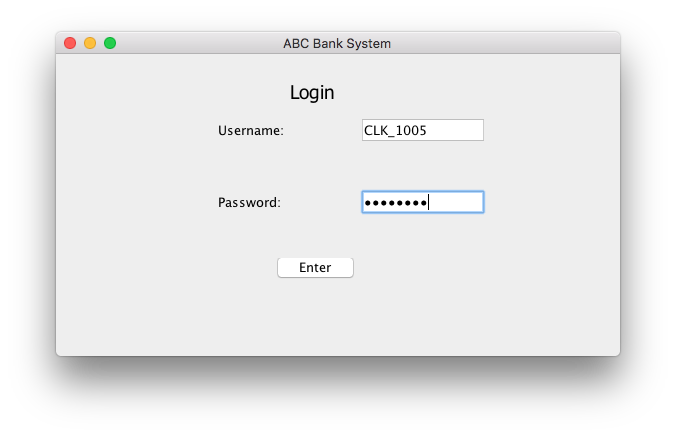
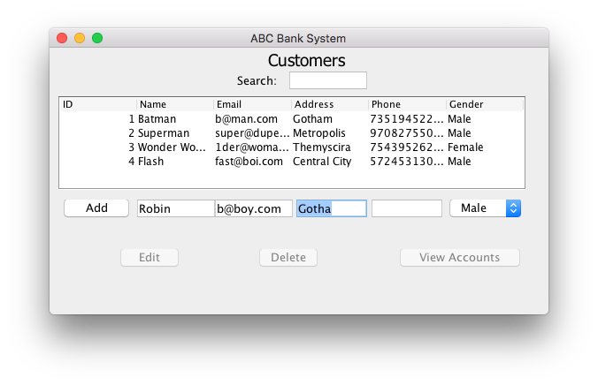
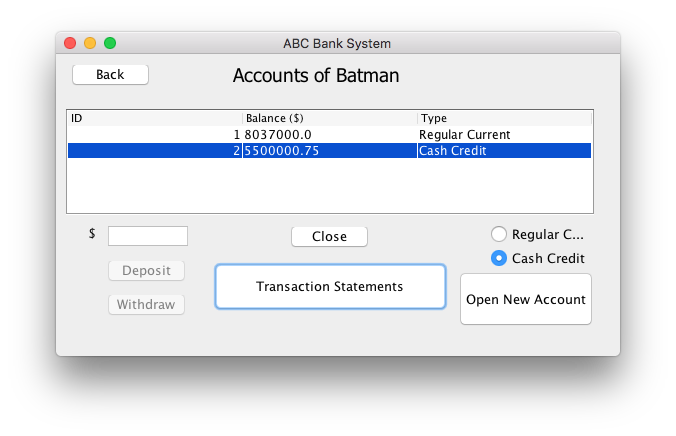
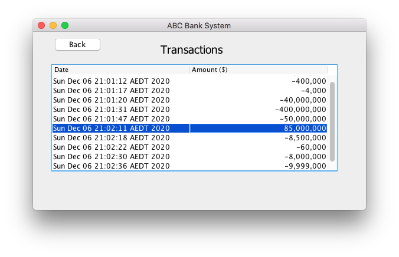

# ABC_Banking_System_2

**TLDR: This is a (kind of) fork of an old [group project](https://github.com/SaeedBaig/ABC_Banking_System). Created to refine app and practice git, Java, CI/CD; WIP, some README instructions/links might be outdated. TODO:**
- [ ] Document shell command to build app
- [ ] Clean up repo by adding unecessary build artifacts to gitignore
- [X] Document shell command to run app
- [ ] Make customer search case-insensitive
- [ ] Make Customer Hub action buttons colored (Green for Add, Red for Delete, Yellow/Orange for Edit)
- [ ] Use icons in Customer Hub action buttons (+ for Add, trashcan for Delete, pencil for Edit)
- [ ] Refine column width in Customer Hub (ID does not have to be that wide; email & phone should probably be wider)
- [ ] Separate business logic from UI (too much business logic in AppWindow.java; move to appropriate other classes)
- [ ] Make CI/CD pipeline to build on commit (confirm app compiles for every push/code-change)

---

Cross-platform GUI bank admin app with persistent DB

This app was made in 4 days as a group project.

## Installation
Just download & extract the [latest release](https://github.com/SaeedBaig/ABC_Banking_System/releases) and double-click the JAR file inside (you'll need [Java installed on your system to run it](https://www.wikihow.com/Run-a-.Jar-Java-File)).

## Screenshots

  
   
  <i>Login screen on startup. The Username and Password are "CLK_1005" and "test@123" respectively (same as in the spec).</i>

  
   
  <i>Customer Hub, where you can see, search for, edit, add, or remove customers</i>

  
   
  <i>Accounts Hub, where you can view, deposit into, withdraw from, and close accounts of a selected customer</i>

  
   
  <i>Transactions, where you can view all transactions of a selected account</i>

## Build instructions
See the [README in `BankProject`](/BankProject/README.md) if you want to build & develop the app yourself.

## Credits
UI - Saeed Baig

DB connection (util, dao) - Danyyil Kucherenko

TODO - Kevin (Chia-Yu) Lin

TODO - Allan Rubin

Entity classes (Customer,Account,Transaction) - Venkata Naga Goutham Alapati
